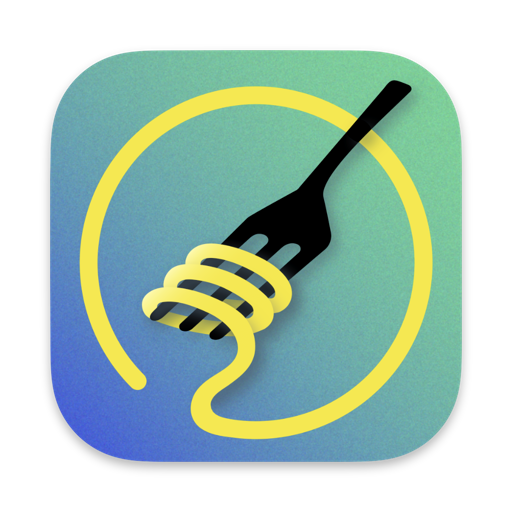

    
    <h1>AlDente - Battery Care & Monitoring</h1>

_macOS menu bar app to limit the maximum charging percentage and improve your MacBook's battery lifespan_

#### Don't overcook your battery! Keep it fresh and chewy with AlDente.

## About this repository

AlDente is no longer open source. The current version of AlDente is proprietary and closed-source.

We use this repository for:
* **Releases:** Download the latest version of AlDente under [Releases](https://github.com/AppHouseKitchen/AlDente-Battery_Care_and_Monitoring/releases).
* **Bug reports and feature requests:** Please use the [Issues](https://github.com/AppHouseKitchen/AlDente-Battery_Care_and_Monitoring/issues) section.
* **Questions:** Please use the [Discussions](https://github.com/AppHouseKitchen/AlDente-Battery_Care_and_Monitoring/discussions) section.

The source code in this repository is legacy code from an older, open-source version of AlDente. It is no longer maintained and does not reflect the current version of the app.

## Why do I need this?

Lithium-ion batteries, like the one in your MacBook, last the longest when they are not kept at 100% for long periods of time. Keeping your battery at a lower charge level, for example 80%, while your MacBook is plugged in can significantly extend its lifespan. More information can be found at [Battery University](https://batteryuniversity.com/article/bu-415-how-to-charge-and-when-to-charge).

## AlDente Free

* **Charge Limiter:** Set the maximum charging percentage of your MacBook. Read more in ["Feature Explanation: Charge Limiter"](https://apphousekitchen.com/feature-explanation-charge-limiter/).
* **Discharge:** Run your MacBook on battery even while it is plugged in, to actively discharge it to your charge limit. Read more in ["Feature Explanation: Discharge"](https://apphousekitchen.com/feature-explanation-discharge/).

## AlDente Pro

AlDente Pro offers many more features, for example:

* Automatic Discharge and Discharge in Clamshell Mode
* Heat Protection
* Sailing Mode
* Top Up
* Calibration Mode
* Control of the MagSafe LED
* Apple Shortcuts support
* Customizable menu bar icons and pop-up window
* Email support

You can find all features and prices on our [website](https://apphousekitchen.com/pricing/). AlDente Pro is also available on [Setapp](https://apphousekitchen.com/pricing/).

## Requirements

* macOS 12 Monterey or later (up to macOS 27 Golden Gate)
* A supported Apple silicon or Intel MacBook. You can check if your MacBook is supported on our [website](https://apphousekitchen.com/pricing/).

## Download & Installation

* Download the latest version under [Releases](https://github.com/AppHouseKitchen/AlDente-Battery_Care_and_Monitoring/releases) or on our [website](https://apphousekitchen.com/).
* Or install it with [Homebrew](https://brew.sh/): `brew install --cask aldente`

You can find a step-by-step guide in our [Installation Guide](https://apphousekitchen.com/installation-guide/).

## How to use

After the installation, click on the AlDente icon in your menu bar and set your desired charge limit, for example 80%. Once your battery reaches the charge limit, your MacBook is powered by the power adapter, and the battery is no longer charging.

On Apple silicon MacBooks, charge limits below 80% can be enabled in the Charge Settings of AlDente.

**Battery calibration:** Keeping your battery at a low charge level for a long time can disturb the battery calibration. Your MacBook might then show a lower capacity or turn off earlier than expected, even though the battery itself is fine. To prevent this, we recommend a full charge cycle (0% to 100%) from time to time, or using the Calibration Mode of AlDente Pro. Newer macOS versions also run an automatic battery calibration, during which macOS temporarily charges the battery to 100%. You can read more about it in [#1846](https://github.com/AppHouseKitchen/AlDente-Battery_Care_and_Monitoring/issues/1846).

## Support

* Most questions are already answered in our [FAQ](https://apphousekitchen.com/faq/) and on our [blog](https://apphousekitchen.com/blog/).
* **Bug reports:** Please open an [issue](https://github.com/AppHouseKitchen/AlDente-Battery_Care_and_Monitoring/issues) and include a debug file. You can find a guide on [How to generate and share a debug file](https://apphousekitchen.com/how-to-generate-and-share-a-debug-file/) on our blog.
* **Email support** is available for AlDente Pro customers through the Help & Support page within AlDente or our [support page](https://apphousekitchen.com/support/).

## Legacy code

The legacy code in this repository uses the following open-source projects:
* <https://github.com/beltex/SMCKit>
* <https://github.com/sindresorhus/LaunchAtLogin>
* <https://github.com/andreyvit/create-dmg>

## Disclaimer

AlDente taps into low-level system functions to control charging. Although it is used by many people without any issues, we do not take any responsibility for any damage resulting from the use of AlDente. Use it at your own risk. Please see the [LICENSE](LICENSE) for details.

Copyright © 2020–2026 AppHouseKitchen GmbH

THE SOFTWARE IS PROVIDED "AS IS", WITHOUT WARRANTY OF ANY KIND, EXPRESS OR IMPLIED, INCLUDING BUT NOT LIMITED TO THE WARRANTIES OF MERCHANTABILITY, FITNESS FOR A PARTICULAR PURPOSE, AND NONINFRINGEMENT. IN NO EVENT SHALL THE AUTHORS OR COPYRIGHT HOLDERS BE LIABLE FOR ANY CLAIM, DAMAGES, OR OTHER LIABILITY, WHETHER IN AN ACTION OF CONTRACT, TORT, OR OTHERWISE, ARISING FROM, OUT OF, OR IN CONNECTION WITH THE SOFTWARE OR THE USE OR OTHER DEALINGS IN THE SOFTWARE.
